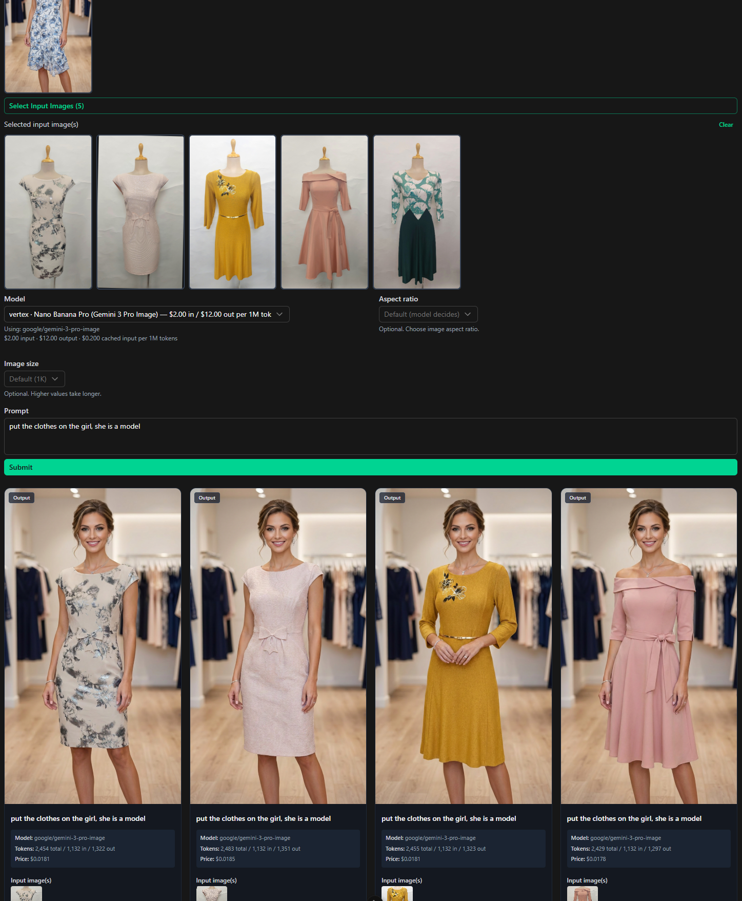

# Auto Product Imagery

AI-powered product image generation for batch product workflows.

Upload product or reference images, choose an image-capable model from Vercel AI Gateway, write one prompt, and generate outputs across all selected inputs. You can also generate from text only, regenerate previous outputs, and refine an existing image into a new standalone result.



## Features

- Batch image generation from multiple input images
- Text-only image generation when no input image is selected
- Model selection through Vercel AI Gateway
- Support for image-output language models and pure image models
- Standalone refinements saved as new generated images
- Local file storage for uploaded and generated images
- SQLite/libSQL database via Drizzle
- Basic cookie authentication for local/private use
- Stored generation metadata, including model, token usage, and estimated price

## Requirements

- Node.js 24.x
- A Vercel AI Gateway API key
- A local SQLite database path

This project uses Vercel AI Gateway through the Vercel AI SDK for all active generation requests.

## Environment

Create a `.env` file in the project root:

```env
# Vercel AI Gateway
NUXT_AI_GATEWAY_API_KEY="your_vercel_ai_gateway_key"

# Basic cookie auth
NUXT_AUTH_USER="admin"
NUXT_AUTH_PASSWORD="use-a-long-random-password"

# Local SQLite/libSQL database
DATABASE_URL="file:./sqlite/drizzle.db"
```

You can copy `example.env` as a starting point.

## Run Locally

Install dependencies:

```bash
npm install
```

Start the Nuxt development server:

```bash
npm run dev
```

Build for production:

```bash
npm run build
```

Preview the production build:

```bash
npm run preview
```

## Run With Docker

Create your `.env` file first, then run:

```bash
docker run --rm \
  -p 3000:3000 \
  --env-file .env \
  -v /folderOnYourMachine/data:/app/data \
  -v /folderOnYourMachine/sqlite:/app/sqlite \
  codethier/autoproductimagery:latest
```

On Windows PowerShell:

```powershell
docker run --rm `
  -p 3000:3000 `
  --env-file .env `
  -v C:\path\to\data:/app/data `
  -v C:\path\to\sqlite:/app/sqlite `
  codethier/autoproductimagery:latest
```

## Database

The app uses Drizzle with a local SQLite/libSQL database.

Useful commands:

```bash
npm run drizzle:generate
npm run drizzle:push
npm run drizzle:studio
```

Generated images are saved under `data/images/output`, and uploaded/selected images live under `data/images`.

## Notes

- Vercel AI Gateway is required for model listing and generation.
- Model availability depends on your Vercel AI Gateway account and provider access.
- Some models support image editing with input images; others are text-to-image only.
- API/provider failures are stored on the generated item so failed runs are visible in the UI.
