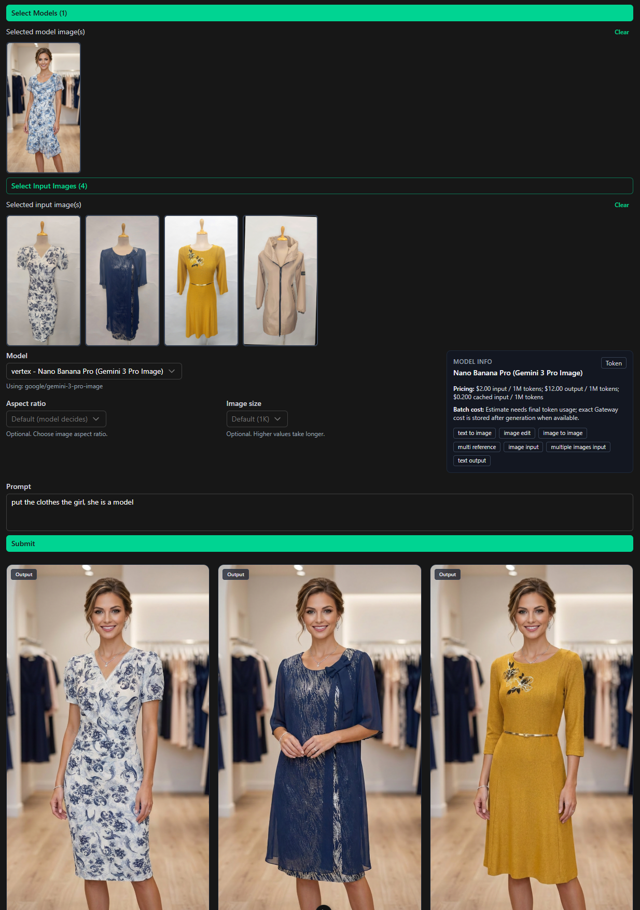
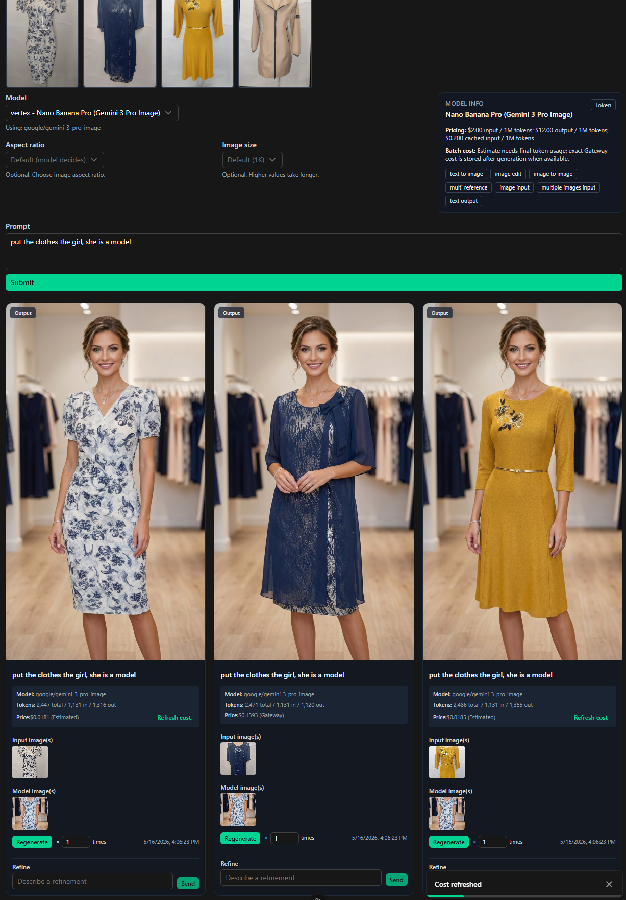

# Auto Product Imagery

AI-powered product image generation for batch product workflows.

Upload product or reference images, choose an image-capable model from Vercel AI Gateway, write one prompt, and generate outputs across all selected inputs. You can also generate from text only, regenerate previous outputs, and refine an existing image into a new standalone result.




----------------------------------------------------------------




## Features

- Batch image generation from multiple input images
- Text-only image generation when no input image is selected
- Model selection through Vercel AI Gateway
- Support for image-output language models and pure image models
- Standalone refinements saved as new generated images
- Local file storage for uploaded and generated images
- SQLite/libSQL database via Drizzle
- Basic cookie authentication for local/private use
- Stored generation metadata, including model, token usage, and estimated price

## Requirements

- Node.js 26.x
- A Vercel AI Gateway API key
- A local SQLite database path

This project uses Vercel AI Gateway through the Vercel AI SDK for all active generation requests.

## Environment

Create a `.env` file in the project root:

```env
# Vercel AI Gateway
NUXT_AI_GATEWAY_API_KEY="your_vercel_ai_gateway_key"

# Basic cookie auth
NUXT_AUTH_USER="admin"
NUXT_AUTH_PASSWORD="use-a-long-random-password"

# Local SQLite/libSQL database
DATABASE_URL="file:./sqlite/drizzle.db"
```

You can copy `example.env` as a starting point.

## Run Locally

Install dependencies:

```bash
npm install
npm run drizzle:migrate
```

Start the Nuxt development server:

```bash
npm run dev
```

Build for production:

```bash
npm run build
```

Preview the production build:

```bash
npm run preview
```

## Run With `node:latest`

No published app image is required. Use the official Node image and mount this repository into the container.

Create your `.env` file first. Then run the app from the project root:

```bash
docker run --rm \
  -p 3000:3000 \
  -w /app \
  --env-file .env \
  -v "$PWD:/app" \
  node:latest \
  sh -lc "npm ci && npm run drizzle:migrate && npm run build && node .output/server/index.mjs"
```

On Windows PowerShell:

```powershell
docker run --rm `
  -p 3000:3000 `
  -w /app `
  --env-file .env `
  -v "${PWD}:/app" `
  node:latest `
  sh -lc "npm ci && npm run drizzle:migrate && npm run build && node .output/server/index.mjs"
```

The bind mount keeps `data/images` and `sqlite/drizzle.db` on your machine because they are normal project folders. Open `http://localhost:3000` after the server starts.

For development with hot reload:

```bash
docker run --rm \
  -p 3000:3000 \
  -w /app \
  --env-file .env \
  -v "$PWD:/app" \
  node:latest \
  sh -lc "npm install && npm run dev -- --host 0.0.0.0"
```

## Database

The app uses Drizzle with a local SQLite/libSQL database. ORM and Kit are pinned to `1.0.0-rc.4`, a v1 release candidate. Both the app and migration commands use `DATABASE_URL`; the migration config loads `.env` for local use.

Useful commands:

```bash
npm run drizzle:generate
npm run drizzle:migrate
npm run drizzle:studio
```

Change `server/db/schema.ts`, generate the SQL, review it, then test it on a disposable database before applying it. Do not use `drizzle-kit push` to bypass migration history.

### Upgrading an existing installation to Drizzle v1

The repository already contains the converted v1 migration folders. All seven original SQL migrations and their timestamps are preserved. The missing snapshot for the historical `0003_price_source` migration was generated with Drizzle Kit, and the later snapshots were regenerated to form a complete chain before conversion.

Back up the database before an approved rollout. Install the locked dependencies with `npm ci`, then run `npm run drizzle:migrate` against the intended database. With these pinned versions, the SQLite migrator automatically adds the v1 bookkeeping columns and matches previously applied migrations. It then applies any pending migrations. Existing installations do not need to rerun their old SQL or reset their database.

For Coolify, use `npm run build` as the build command and this start command after the database rollout is approved:

```sh
npm run drizzle:migrate && exec node .output/server/index.mjs
```

The runtime needs Drizzle Kit, `drizzle.config.ts`, `server/db/schema.ts`, and the `drizzle/` directory. Keep the SQLite database on persistent storage and run migrations from one instance at a time.

`npm run drizzle:up` converts migration files during a future format upgrade. Run it during development and commit the reviewed output; do not add it to the startup command. See the [Drizzle v1 upgrade guide](https://orm.drizzle.team/docs/upgrade-v1).

Generated images are saved under `data/images/output`, and uploaded/selected images live under `data/images`.

## Notes

- Vercel AI Gateway is required for model listing and generation.
- Model availability depends on your Vercel AI Gateway account and provider access.
- Some models support image editing with input images; others are text-to-image only.
- API/provider failures are stored on the generated item so failed runs are visible in the UI.
