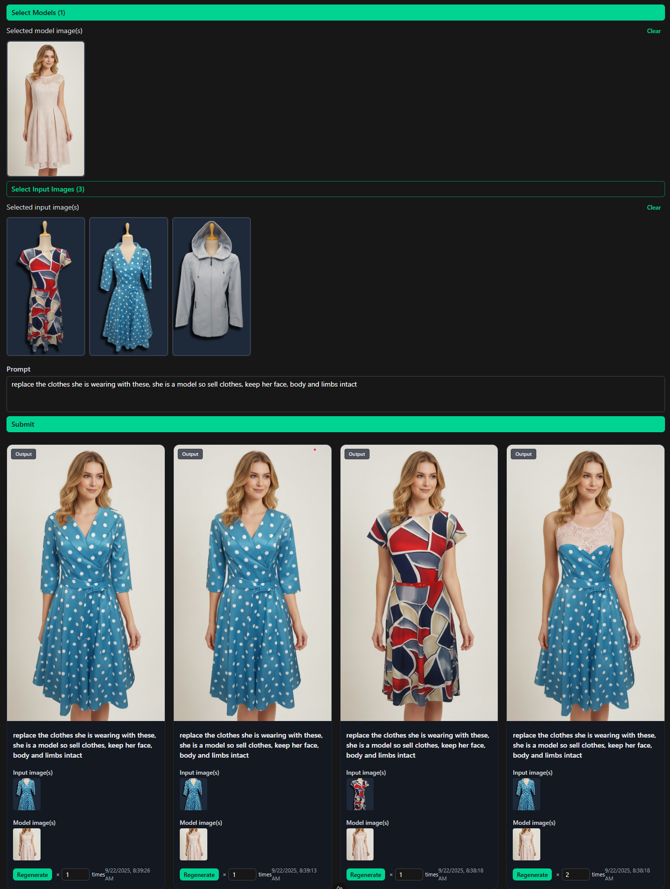

# Auto Product Imagery

Generate product imagery with a simple web app. Below are quick-start instructions and an example output image.
You may use it for other things aswell, models are images that get submitted with the same prompt for every input image selected, making workflows a lot faster with big batches.

## Run with Docker

```bash
docker run -p 3000:3000 \
  --env-file .env \
  ghcr.io/your-org-or-user/autoproductimagery:latest 
-v /folderOnYourMachine/data:/app/data 
-v /folderOnYourMachine/sqlite:/app/sqlite
```

Alternatively, you can run locally with Node (see package.json scripts).

## Example .env

Create a .env file at the project root based on the following:

```env
GEMINI_API_KEY="AIzaXXXXXXXXXXXXXXXXXXXXXXXX"
# Basic cookie auth for server-side routes
NUXT_AUTH_USER="admin"
NUXT_AUTH_PASSWORD="secretMakeItVeryLongAndSecure"
DATABASE_URL="file:./sqlite/drizzle.db"
```

## Example Output

Below is a sample generated image. This file lives in the repo so it renders on GitHub.



## Notes

- The Gemini API may be unstable; errors can occur as it is a google product.... it likes to flag images unsafe when called via the API.